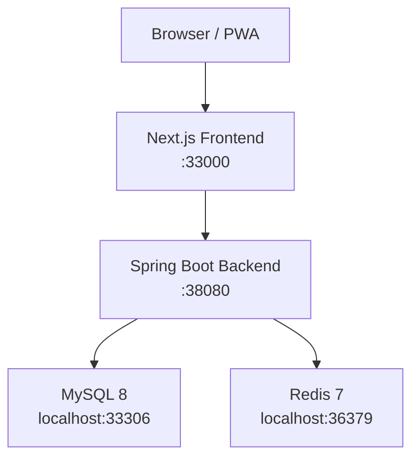

# 系统架构

## 1. 文档目标

本文档描述 Mamoji 当前版本的运行拓扑、代码分层、核心业务流与演进方向，帮助开发、测试、运维和产品成员快速建立统一认知。

## 2. 架构总览

Mamoji 目前采用前后端分离的单体架构：

- 前端：Next.js App Router 提供 Dashboard、报表、AI 助手等页面。
- 后端：Spring Boot 提供 REST API、鉴权、业务规则、风险控制与 AI 编排。
- 数据层：MySQL 负责核心业务持久化，Redis 作为本地联调与后续缓存/扩展能力的基础依赖。
- 交付层：Docker Compose 负责本地依赖组件，GitHub Actions 负责 CI/CD。

## 3. 设计原则

- 前后端职责清晰：前端负责交互、状态展示与调用编排，后端负责业务约束、权限和数据一致性。
- 单体优先：在当前业务规模下优先保证开发效率、部署简洁度与数据一致性。
- 风控内聚：预算和交易相关风险校验尽量靠近写路径，避免前端绕过。
- AI 可退化：模型不可用时支持兜底回答、工具退化和模式切换。
- 文档即协作接口：架构文档、API 文档和注释需要与实际代码保持同步。

## 4. 代码目录映射

| 路径 | 职责 |
| --- | --- |
| `frontend/src/app` | 页面路由、布局和页面级数据装配 |
| `frontend/src/components` | 复用组件、Dashboard 布局、AI 助手 UI、交易表单等 |
| `frontend/src/lib` | API Client、React Query Hooks、主题、WebSocket 等基础能力 |
| `backend/src/main/java/com/mamoji/controller` | REST API 入口，鉴权用户注入与响应封装 |
| `backend/src/main/java/com/mamoji/service` | 核心业务服务，承载账户/预算/账本/AI 等业务逻辑 |
| `backend/src/main/java/com/mamoji/ai` | AI 编排、模式路由、质量门控、工具调用与意图分类 |
| `backend/src/main/java/com/mamoji/repository` | JPA Repository 与聚合查询 |
| `backend/src/main/resources` | Spring Boot 配置、环境差异化参数 |
| `docs` | 面向团队的架构、接口、部署、数据库和风控文档 |

## 5. 后端架构

### 5.1 Controller 层

Controller 统一暴露 `/api/v1/**` 接口，主要承担以下职责：

- 解析请求参数与路径变量。
- 从 `@AuthenticationUser` 获取当前登录用户。
- 做轻量权限前置判断。
- 调用 Service 或 AI 编排服务。
- 返回统一响应结构：`code / message / data`。

当前主要模块包括：

| Controller | 责任 |
| --- | --- |
| `AuthController` | 注册、登录、资料更新、密码修改 |
| `AccountController` | 账户 CRUD 与汇总 |
| `BudgetController` | 预算 CRUD、有效预算查询 |
| `TransactionController` | 交易 CRUD、退款、预算同步、风险标记 |
| `StatsController` | 总览、趋势、分类、洞察、高级统计 |
| `AIController` | Auto / Agent / LLM 三种问答入口与流式响应 |
| `BackupController` | 数据导出、导入校验占位 |
| `LedgerController` | 账本与成员管理 |
| `RecurringController` | 周期记账的临时内存实现 |
| `AdminUserController` | 管理员用户管理 |

### 5.2 Service 层

Service 层承载领域逻辑，强调“规则集中、控制器薄、Repository 纯查询/持久化”。

| Service | 责任 |
| --- | --- |
| `AccountService` | 账户 CRUD、归属校验、汇总计算 |
| `BudgetService` | 预算创建、区间校验、预算快照与已用金额重算 |
| `LedgerService` | 账本 CRUD、成员管理、默认账本逻辑 |
| `AIService` | 兼容旧版 AI 接口调用 |
| `AiOrchestratorService` | 新版 AI 统一入口、模式路由、质量门控、结构化输出 |

### 5.3 Repository 层

Repository 基于 Spring Data JPA，负责：

- 实体 CRUD。
- 报表类聚合查询。
- 根据用户、分类、账本、日期范围检索数据。
- 为交易风控和预算快照提供基础数据。

## 6. 核心业务域

### 6.1 账户域

- 管理现金、银行卡、负债等账户。
- 提供总资产、总负债、净资产汇总。
- 支撑高级报表中的资产视图。

### 6.2 分类域

- 支持系统分类与家庭自定义分类。
- 为交易、预算、统计和 AI 分析提供统一分类语义。

### 6.3 预算域

- 支持按时间区间配置预算。
- 支持总预算与分类预算。
- 维护 `spent / remaining / usageRate / warningThreshold` 等派生信息。
- 为 AI 助手和高级报表输出预算健康度。

### 6.4 交易域

- 负责收入、支出、退款等核心流水。
- 写入时校验账户、分类、账本归属。
- 与预算同步、退款链路、风控规则直接耦合。

### 6.5 报表域

- 由 `StatsController` 聚合交易、账户、预算数据。
- 输出首页摘要、月度趋势、同比环比、年度报表和洞察面板。
- 支撑“最近支出 / 最近收入 / 大额支出 / 大额收入 / 本月 / 本年汇总”等首页与报表卡片。

### 6.6 AI 助手域

AI 模块分成三层：

| 层级 | 说明 |
| --- | --- |
| `ai.intent` | 财务意图分类器，识别预算、分类、流水、收支等问题 |
| `ai.tool` / `agent` | 工具路由、Agent 调用、工具结果标准化 |
| `ai` | 模型网关、模式选择、结构化回复和兜底策略 |

当前支持三种问答模式：

- `auto`：自动选择工具与模型路径。
- `agent`：优先走工具编排，适合预算/流水/统计类问题。
- `llm`：直接模型回答，适合解释性与开放式问题。

## 7. 风控架构

预算和交易风险控制是当前业务增强重点，核心思路如下：

- 风险靠近写路径：交易新增、更新、退款时同步做规则判断。
- 规则结果结构化：不仅返回阻断，还返回警告、标签和建议。
- 预算联动：交易影响预算已用金额，预算状态再反过来影响首页、报表和 AI 建议。

当前重点规则覆盖：

- 预算超额与预警阈值识别。
- 大额交易识别。
- 高频支出与可疑波动识别。
- 退款链路与原始交易关联校验。
- 分类/账户/账本归属校验。

## 8. 前端架构

### 8.1 路由与布局

- 使用 Next.js App Router。
- `(dashboard)` 下承载首页、交易、预算、报表、设置、AI 助手等主业务页面。
- `DashboardLayout` 负责侧边栏、内容区域与页面容器统一布局。

### 8.2 数据访问层

前端统一通过 `frontend/src/lib/api.client.ts` 和 `api-services` 调用后端：

- 自动附带 Token。
- 统一处理错误响应。
- 避免 HTML 被误当成 JSON。
- 为 React Query 提供稳定的数据源。

### 8.3 状态管理

- 以 React Query 为主，管理查询缓存和失效策略。
- 局部 UI 状态由组件自身维护。
- 主题与全局 UI 基础能力由 provider 统一注入。

### 8.4 交互重点

- 首页强调财务摘要、近期交易、快速入口和风险提示。
- 报表页承载年度、对比、高级报表等分析视图。
- AI 助手支持财务助手与股票助手两类会话。

## 9. 数据与基础设施

### 9.1 MySQL

MySQL 是核心业务主库，主要保存：

- 用户、权限、家庭信息。
- 账户、分类、账本与成员。
- 交易、退款链路、预算。
- 支撑报表和 AI 工具的数据明细。

当前本地映射端口统一为 `33306`。

### 9.2 Redis

Redis 作为本地依赖与扩展位，主要用于：

- 统一本地环境组件编排。
- 为后续缓存、限流、流式会话状态等能力留出基础设施位置。

当前本地映射端口统一为 `36379`。

### 9.3 Docker 网络

- Docker Desktop 相关依赖组件统一加入 `mamoji` 网络。
- 便于本地多容器互通和未来旁路服务扩展。

## 10. 配置与环境约定

### 10.1 本地开发

默认本地依赖：

- Frontend: `http://localhost:33000`
- Backend: `http://localhost:38080`
- MySQL: `localhost:33306`
- Redis: `localhost:36379`

可通过环境变量覆盖：

- `SPRING_DATASOURCE_URL`
- `SPRING_DATASOURCE_USERNAME`
- `SPRING_DATASOURCE_PASSWORD`
- `SPRING_REDIS_HOST`
- `SPRING_REDIS_PORT`

### 10.2 部署与联调

- `docker-compose.yml`：本地开发与依赖编排。
- `docker-compose.prod.yml`：生产部署参考。
- `docker-compose.network-mamoji.override.yml`：统一加入 `mamoji` 网络。

## 11. 关键请求流

### 11.1 登录与鉴权

1. 前端调用 `/api/v1/auth/login`。
2. 后端验证邮箱和密码并签发 JWT。
3. 前端持久化 Token。
4. 后续请求自动带上 `Authorization: Bearer <token>`。
5. 后端过滤器恢复用户上下文。

### 11.2 交易创建与预算同步

1. 前端提交交易表单。
2. 后端校验账户、分类、账本归属。
3. 触发风控规则识别阻断或警告。
4. 交易持久化。
5. 预算快照与已用金额同步更新。
6. 首页、报表、AI 工具读取到最新数据。

### 11.3 AI 助手问答

1. 前端提交问题、助手类型和模式。
2. 后端意图分类器识别问题类型。
3. `AiOrchestratorService` 选择 Auto / Agent / LLM 路径。
4. 工具结果或模型结果进入质量门控。
5. 返回结构化回答、来源、警告和模式信息。

## 12. 质量与维护约定

- 后端 Controller / Service 维持类级和方法级 Javadoc。
- 前端复杂组件、导出函数与 API 封装补充 JSDoc。
- 文档中的端口、路由、依赖网络需与实际配置同步。
- 新增风控规则和 AI 工具时，优先补充对应设计说明与接口文档。

## 13. 后续演进建议

1. 将 AI 编排、工具执行和交易核心进一步解耦，形成更清晰的边界。
2. 为高价值写路径补充更系统的集成测试和 E2E 回归。
3. 引入 OpenAPI 生成对外接口清单和前端 SDK。
4. 报表层沉淀统一指标定义，避免页面和 AI 各自重复计算。
